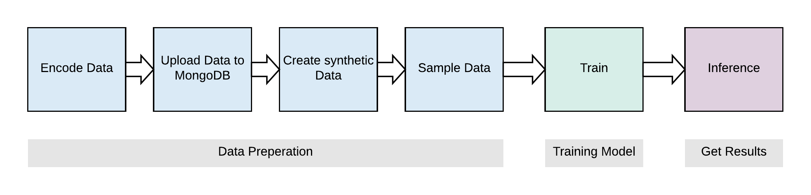
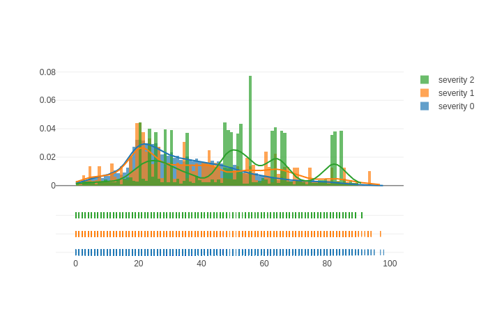
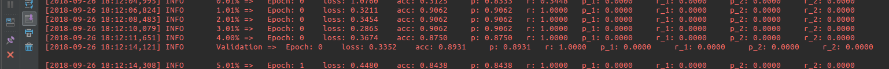
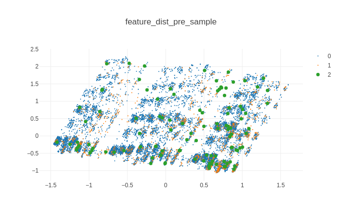
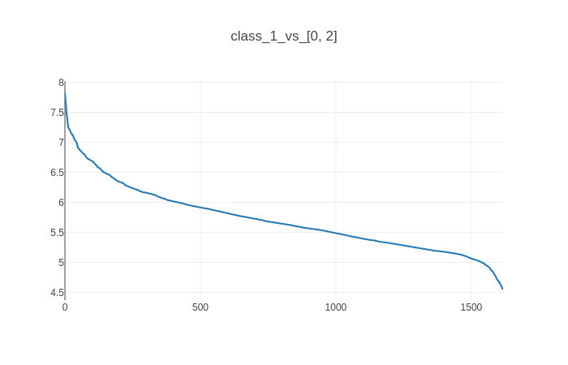
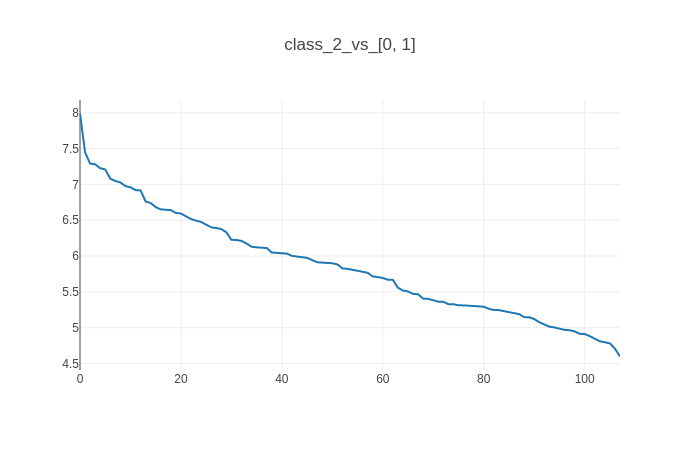
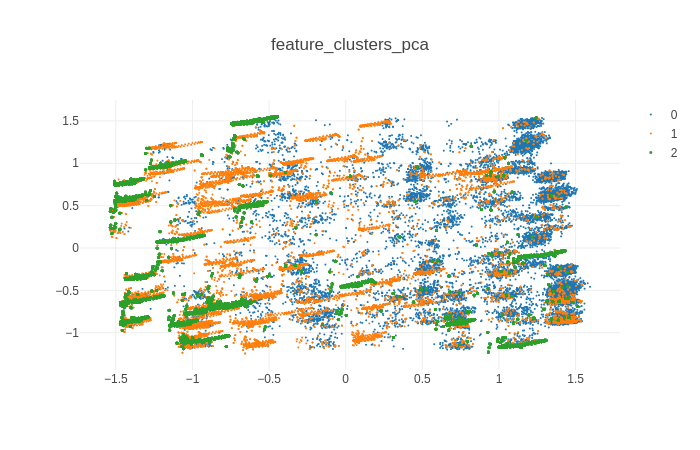
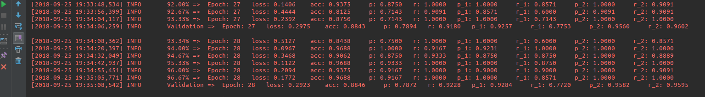
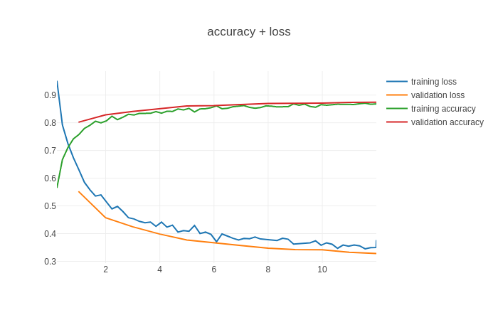

# Accident Prediction

This application is motivated by this [code competition](https://www.it-talents.de/foerderung/code-competition/code-competition-09-2018). The goal is to predict the severity of accidents based on a set of features such as weather, time or date.

Table of Contents:
1. [ Application Setup ](#app_setup)
    1) [ Install Conda ](#conda)
    2) [ Install MongoDB ](#mongodb)
    3) [ Install PyCharm (optional) ](#pycharm)
    4) [ Code Overview ](#overview)
    5) [ Getting Started ](#getting_started)
2. [ Data Management ](#data_manage)
    1) [ Upload Data ](#upload_data)
    2) [ Data Sampling ](#data_sampling)
3. [ Training the Model ](#train)
4. [ Inference and Results ](#results)

<a name="app_setup"></a>
## Application Setup

The whole setup and documentation assumes a Linux based system. By using a Linux bash shell and with all the requirements installed (Conda, MongoDB), the application should also run on a Windows machine. But I haven't tested it.

<a name="conda"></a>
### Install Conda
You can either install Anaconda or Miniconda (https://conda.io/miniconda.html). It is used for package and environment management. The __environment.yml__ file is specifying all the packages needed.</br>
Check the box to add `conda` to your PATH in the .bashrc file or do it manually after installation.

<a name="mongodb"></a>
### Install MongoDB
The MongoDB is used to easily manage and access trained experiments. As it can be samowhat different depending on your Linux distribution, it is best to follow the official MongoDB documentation: https://docs.mongodb.com/manual/administration/install-on-linux/.

<a name="pycharm"></a>
### Install PyCharm (optional)
If you want to get into python development or change the code in this application, PyCharm is most probably your goto editor https://www.jetbrains.com/pycharm/.</br>
For installation, download the Community edition: https://www.jetbrains.com/pycharm/download and follow the instructions.

<a name="overview"></a>
### Code Overview
The main machine learning and data management is taken care of by the dlpipe module in the dlpipe folder.</br>
It uses keras models for training ANNs and accesses the MongoDB to read training data as well as saves trainined models and their results.</br>

The application specific files are located in the __accident_predictor__ folder. The __data__ folder contains all files needed to process the raw data -> write it to the MongoDB -> and sample that data. Additionally, there are some useful modules generating different plots for data analysis.

The training and inference (and results) can be found in the different train folders e.g. __application_predictor/train_v1_simple__.</br>
To train the model run `>> train.py` for optaining the results in a csv list with accident_id and severity run `>> inference.py`.


<a name="getting_started"></a>
### Getting Started
First, you need to create the file: __accident_predictor/connections.ini__ (there is a template file in the same location). If you did not create any user + password on your MongoDB installation, you are good to go. In case you did, specify the user and password in the .ini file.
``` bash
# start up the mongodb if you haven't yet
>> service mongod start
# execute the setup script
>> bash setup.sh
```
It creates a cond environment with all the needed python modules. You just need to run it once. </br>
In order to execute the python source files from the project from the console, you need to add the project source to the PYTHONPATH. This is done
by adding `export PYTHONPATH="my_path_to/accident_predictor"` to your __~/.bashrc__ file.

In case you have installed PyCharm you can must add your conda environment to the interpreters by adding the existing conda env:
e.g. __~/miniconda3/env/accident_predictor_env/bin/python__

<a name="data_manage"></a>
## Data Management

As seen in [ Code Overview ](#overview), the data management has multiple steps to go from raw data to a trainable dataset.

<a name="upload_data"></a>
### Uploading raw data to MongoDB
The original data is located in __accident_predictor/data/upload__ in .csv files. There are multiple features with 3 types:
1) Class features such as *weather_condition*
2) Float value features such as *age*
3) Cyclic float value features such as *time*

These features need to be encoded in suitable formats. For float value features such as *age*, it is straightforward. Their values can just be saved as is.

Cyclic features will be encoded in a sin and cos component to show the machine learning algorithm its cyclic nature. Otherwise, there is no way for the algorithm to know that e.g. the difference from 23:00 to 01:00 is just 2 hours.

The class features need to be encoded as 1-hot encoded bit arrays. Thus if a feature contains three possible classes such as `["Driver", "Pedestrian", "Co-Driver"]`, the class "Pedestrian" would be encoded as `[0, 1, 0]`.

This encoding can be found in __data/upload/data_encoder.py__, which also takes care of some poorly chosen dataformats and class namings.</br>
This encoded data can be uploaded to the MongoDB with __data/upload/mongo_uploader.py__.

#### Class distribution
The data analysis (__data/analysis/data_distribution.py__) shows that the dataset is very imbalanced as there are far more accidents with lower severity (class 0) than with higher severity (class 1) or even death (class 2). In numbers [13495, 1618, 108].</br>
Apart from that, the class distribution of the original dataset also shows other effects:
- Clamping *nr_persons_hurt* to 5 as the data with higher numbers is not dense enough
- Clamping *nr_vehicles* at 3 for the same reason
- *vehicle_type*: merging some similar and under represented classes such as [LKW bis 7.5t, Transporter, Kleinbus] to one.
- *light*: merge [Dunkelheit: Strassenbleuctung vorhanden und nicht beleuchtet, Dunkeleheit keine Strassenbleuchtung] as it basically is the same.

e.g. age distrubtion plot:</br>



<a name="data_sampling"></a>
### Data Sampling
As the data is very imbalanced towards lower severity accidents, the data needs to be balanced somehow. When training a model with the original encoded data, the algorithm will basically always say class 0. Despite an accuracy of almost 90%, the recall for class 1 and class 2 is zero.

p = precision (class 0), r = recall (class 0), p_1 = precision (class 1), ...

#### Synthetic Data
There are different known techniques for synthetic data generation such as SMOTE or ADASYN. The issue I had with these methods, is that our feature vector is highly dimensional. For example, when reducing the features to 2d with PCA, there are no clusters for the classes visible at all:



So I tried to create my own data augmentation algorithm. The first step is to find the dataset which describes class 1 and class 2 in the most distinctive way. To achieve that, I calculated the distance from each class 1 and 2 to the other 2 classes. The distance increases if the features are different.




For instance, when looking at the top distance for class 2, you can really imagine this to be a very bad accident (Unfall_ID=5152). It ticks all the red flags such as wet surface, higher age, dark, injured person is pedestrian etc.

The records with the highest distance values are now used to create new data by changing just one feature at a time. By taking the top 20 results for class 2 and the top 70 results for class 1 the new class distribution is: [13495, 7498, 1788]</br>
In the last step, classes 1 and 2 are sampled by just copying records to have an even class distribution.</br>
The new PCA 2D scatter plot also shows, that the data generation created some visible clusters, even though there are still a lot of overlaps.



<a name="train"></a>
## Training the model
Before training the model, the data must be set up. This can be done by calling the two data setup files in the __accident_predictor/data/upload/__ folder:
``` python
# encode data and upload to MongoDB
>> python mongo_uploader.py
# create synthetic data and sample data for even class distrubtion
>> python sampler.py

>> cd ..
# start training
>> python train.py
```

In order to see how each of the classes is performing against the others, a custom single class precision and recall metric is added (p, r, p_1, r_1, p_2, r_2):


<a name="results"></a>
## Inference and Results
After training is done, the training and validation loss and accuracy are automatically plotted:


To apply the trained model on the unlabeld test records, call:
```
# apply trained model to test data and create a csv file of these results
>> python inference.py
```
